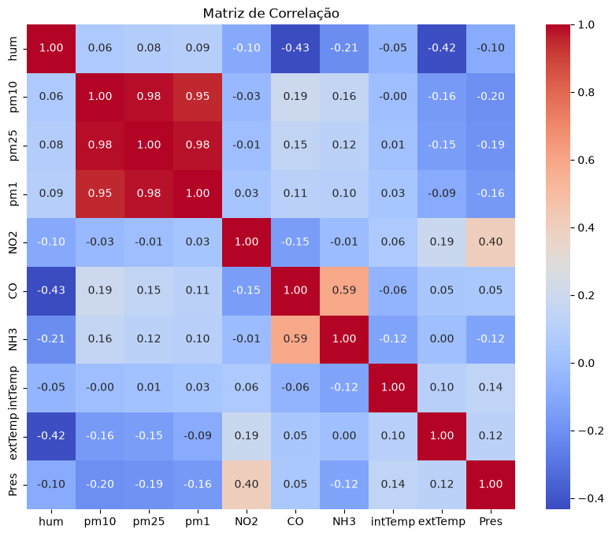
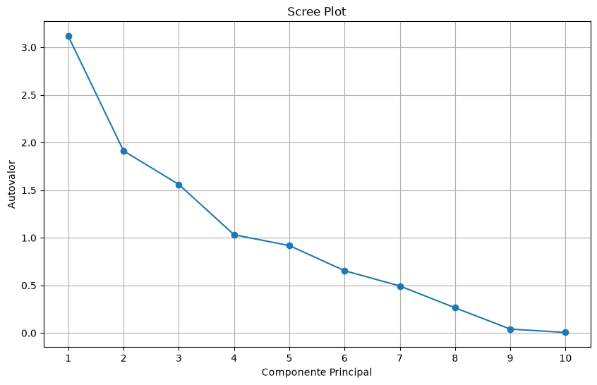
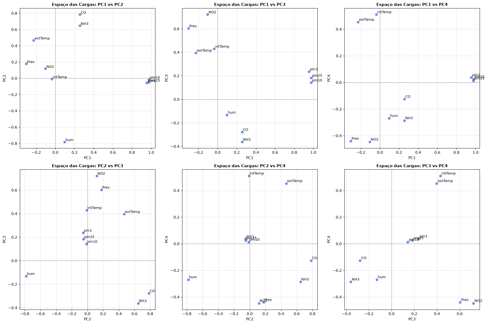
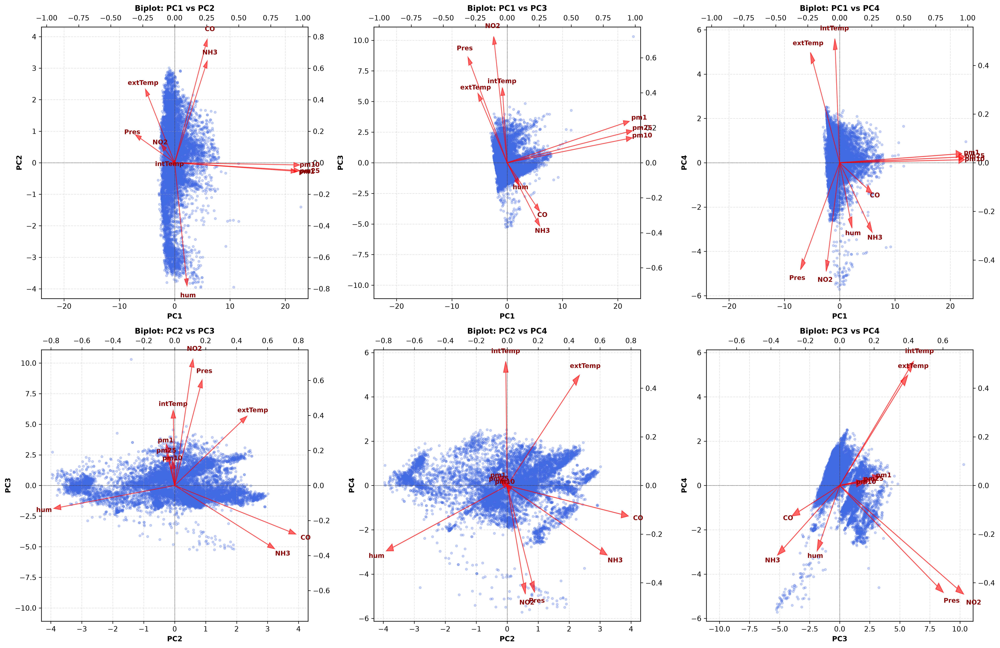
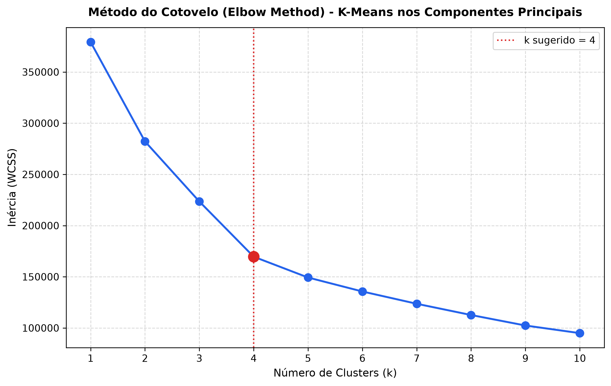
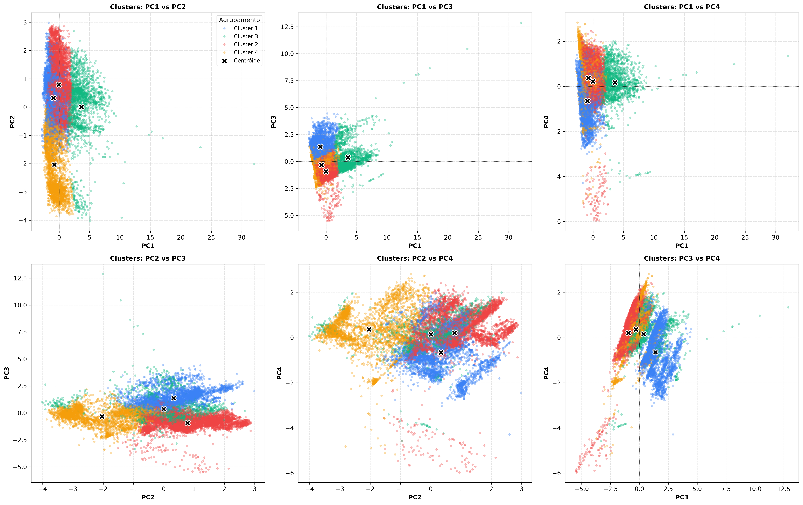

# Análise de Componentes Principais (PCA) em Dados de Qualidade do Ar

Este repositório contém um estudo de caso completo de **Análise de Componentes Principais (PCA)** aplicada a dados de monitoramento ambiental e qualidade do ar. O objetivo principal é reduzir a dimensionalidade do conjunto de sensores, identificar padrões multivariados e isolar os fatores latentes que governam a dispersão de poluentes e variáveis meteorológicas.

---

## Visão Geral do Estudo

O estudo analisou **~2,08 milhões de registros** (`2.080.369` observações tratadas) coletados por múltiplos sensores ambientais.

### Variáveis Selecionadas (10 Features):
- **Material Particulado:** `pm1`, `pm25`, `pm10`
- **Gases e Poluentes:** `NO2`, `CO`, `NH3`
- **Variáveis Meteorológicas/Ambiente:** `hum`, `intTemp`, `extTemp`, `Pres`

---

## Validação Estatística de Fatorabilidade

Antes da aplicação do PCA, a adequabilidade do conjunto de dados para redução de dimensionalidade foi validada por meio de testes estatísticos formais:

| Teste | Métrica Obtida | Critério de Aceitação | Conclusão |
| :--- | :--- | :--- | :--- |
| **KMO (Kaiser-Meyer-Olkin)** | **`0.5872`** | $> 0.50$ | Adequado para análise fatorial/PCA |
| **Esfericidade de Bartlett** | $\chi^2 = 1.783 \times 10^7$ | $p\text{-valor} < 0.001$ ($p = 0.000$) | Matriz de correlação não é identidade ($H_0$ rejeitada) |

### KMO Individual por Variável:
- `pm10`: **0.70** | `pm1`: **0.66** | `intTemp`: **0.65** | `pm25`: **0.58** | `hum`: **0.55**
- `NH3`: **0.50** | `CO`: **0.49** | `extTemp`: **0.48** | `Pres`: **0.47** | `NO2`: **0.39**



---

## Decomposição Espectral e Retenção de Componentes

Adotando o **Critério de Kaiser (Autovalor $\lambda > 1$)** e o **Scree Plot**, foram retidos **4 Componentes Principais**, capazes de reter **76,20% de toda a variância original**:

| Componente | Autovalor ($\lambda$) | % Variância Explicada | % Variância Acumulada |
| :---: | :---: | :---: | :---: |
| **PC1** | **3.1154** | **31.15%** | **31.15%** |
| **PC2** | **1.9124** | **19.12%** | **50.28%** |
| **PC3** | **1.5602** | **15.60%** | **65.88%** |
| **PC4** | **1.0320** | **10.32%** | **76.20%** |
| PC5 | 0.9185 | 9.18% | 85.38% |
| PC6 | 0.6546 | 6.55% | 91.93% |
| PC7 | 0.4942 | 4.94% | 96.87% |
| PC8 | 0.2653 | 2.65% | 99.52% |
| PC9 | 0.0415 | 0.42% | 99.94% |
| PC10 | 0.0060 | 0.06% | 100.00% |

> *Nota: Um modelo alternativo mais parcimonioso com 3 componentes retém 65.88% da variância.*



---

## Interpretação Física dos Componentes

### 1. **PC1 (31.15%) – Fator de Material Particulado**
- Fortíssima correlação com **`pm25` (+0.98)**, **`pm10` (+0.98)** e **`pm1` (+0.95)**.
- Isola episódios de acumulação de materiais particulados.

### 2. **PC2 (19.12%) – Fator de Combustão e Umidade**
- Forte correlação positiva com **`CO` (+0.78)** e **`NH3` (+0.65)**, e forte correlação negativa com **`hum` (-0.78)**.
- Demonstra que períodos de baixa umidade favorecem maiores concentrações de gases de combustão.

### 3. **PC3 (15.60%) – Fator de Tráfego e Pressão**
- Altas cargas em **`NO2` (+0.72)** e **`Pres` (+0.60)**.
- Reflete emissões de gases de veículos com à estabilidade atmosférica e pressão atmosférica local.

### 4. **PC4 (10.32%) – Fator de Dinâmica Térmica**
- Dominado por **`intTemp` (+0.51)** e **`extTemp` (+0.45)**.
- Captura os ciclos de temperatura diurna/noturna e gradiente térmico entre os ambientes interno e externo.

### Espaço das Cargas
Visualização da distribuição e correlações das variáveis originais nos diferentes planos formados pelas combinações de componentes principais:



### Biplot dos Componentes
Projeção conjunta das observações e dos vetores de carga das variáveis nos 6 planos formados pelas 4 componentes principais:



**Síntese da Análise do Biplot:**
- **Alinhamento dos Particulados:** Os vetores `pm1`, `pm25` e `pm10` projetam-se juntos na direção positiva de PC1, mostrando forte correlação e isolando momentos de alta poluição por poeira e fumaça.
- **Relação Inversa Gases vs Umidade:** No eixo PC2, `CO` e `NH3` apontam em sentido oposto a `hum`, indicando acúmulo de poluentes gasosos em períodos de baixa umidade.
- **Efeitos Térmicos e Barométricos:** `NO2` e `Pres` guiam a dispersão em PC3, enquanto `intTemp` e `extTemp` regem a separação ao longo de PC4.

---

## Agrupamento K-Means nas Componentes Principais

Para segmentar os registros em regimes distintos de qualidade do ar e condições meteorológicas, aplicou-se o algoritmo **K-Means** sobre os escores dos 4 componentes principais.

### Método do Cotovelo (Elbow Method)
Para $k$ variando de 1 a 10 evidencia o ponto de inflexão na curva em **$k = 4$**:



### Distribuição dos Clusters nos Componentes (6 Pares)
Projeção dos 4 clusters formados e seus respectivos centróides (marcados em `X`) ao longo de todos os pares de componentes principais:



Ao observar a PC4 em todas as análises, podemos observar resultados controversos. É necessário analisar possiblidade de remover essa componente.

---

## Como Executar o Projeto

### 1. Clonar ou Acessar o Diretório
```bash
cd "C:\Users\Usuario\Desktop\PCA-AR"
```

### 2. Instalar as Dependências
Recomenda-se utilizar um ambiente virtual (`.venv`):
```bash
pip install numpy pandas matplotlib seaborn scikit-learn scipy factor-analyzer mpl-axes-aligner
```

### 3. Executar o Notebook
Abra o Jupyter Notebook ou execute através do VS Code / Jupyter Lab:
```bash
jupyter notebook main_notebook.ipynb
```

---