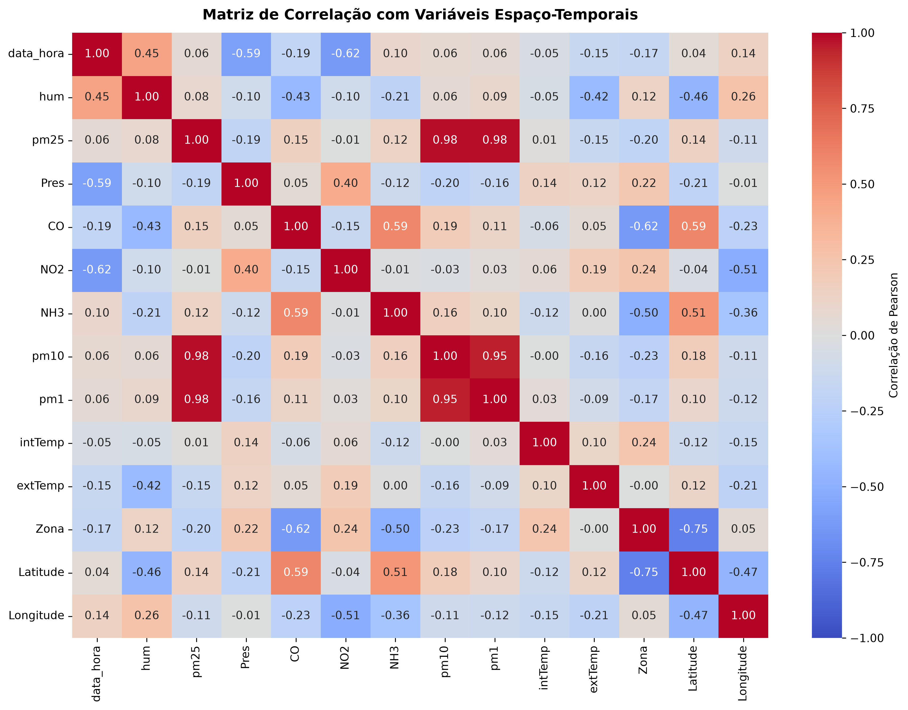
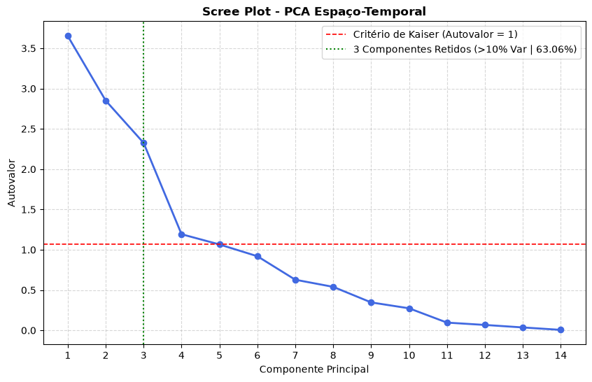
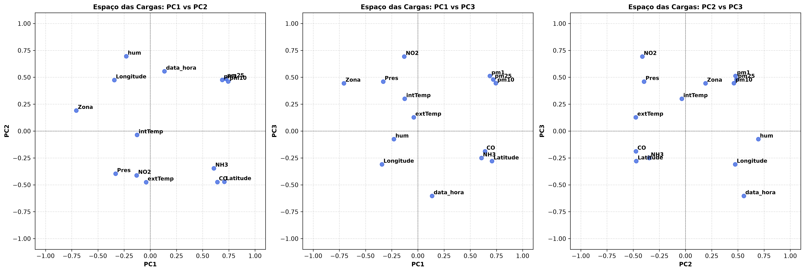
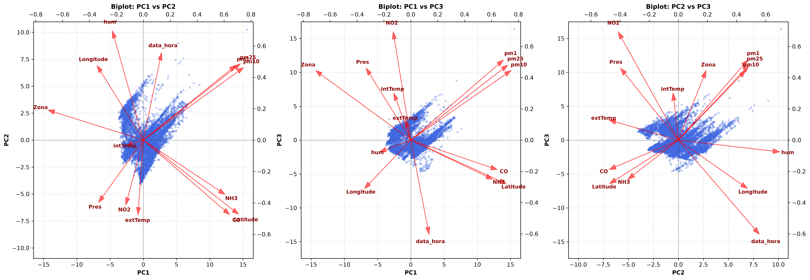

# Análise de Componentes Principais (PCA) com Variáveis Espaço-Temporais (3 Componentes)

Este documento registra os resultados do estudo de caso de **Análise de Componentes Principais (PCA)** com atributos geográficos (`Zona`, `Latitude`, `Longitude`) e temporais (`data_hora`), refinado para reter **3 Componentes Principais** (autovalor $\lambda > 1$ e variância explicada individual $> 10\%$).

---

## 1. Variáveis Analisadas (14 Features)

- **Sensores de Material Particulado:** `pm1`, `pm25`, `pm10`
- **Sensores de Gases e Poluentes:** `NO2`, `CO`, `NH3`
- **Variáveis Meteorológicas / Ambiente:** `hum`, `intTemp`, `extTemp`, `Pres`
- **Atributos Espaciais:** `Zona` (codificada categoricamente), `Latitude`, `Longitude`
- **Atributo Temporal:** `data_hora` (convertida para epoch timestamp numérico)

Total de registros processados após remoção de valores ausentes: **2.080.369 observações**.

---

## 2. Validação Estatística de Fatorabilidade

| Teste | Métrica Obtida | Critério de Aceitação | Conclusão |
| :--- | :--- | :--- | :--- |
| **KMO (Kaiser-Meyer-Olkin)** | **`0.5529`** | $> 0.50$ | Adequado para análise fatorial / PCA |
| **Esfericidade de Bartlett** | $\chi^2 = 2.825 	imes 10^7$ | $p	ext{-valor} < 0.001$ ($p = 0.000$) | Matriz de correlação não é identidade ($H_0$ rejeitada) |

### KMO Individual por Variável:
- `Pres`: **0.73** | `NH3`: **0.72** | `pm10`: **0.70** | `pm1`: **0.68** | `intTemp`: **0.65**
- `CO`: **0.60** | `pm25`: **0.60** | `Latitude`: **0.53** | `Zona`: **0.49** | `data_hora`: **0.46**
- `NO2`: **0.44** | `hum`: **0.42** | `extTemp`: **0.41** | `Longitude`: **0.38**

### Matriz de Correlação

---

## 3. Decomposição Espectral e Critério de Retenção

Adotando o critério de **Autovalor $\lambda > 1$** e **Variância Explicada Individual $> 10\%$**, foram retidos **3 Componentes Principais**, explicando **63,06% da variância total acumulada**:

| Componente | Autovalor ($\lambda$) | % Variância Explicada | % Variância Acumulada |
| :---: | :---: | :---: | :---: |
| **PC1** | **3.6518** | **26.08%** | **26.08%** |
| **PC2** | **2.8508** | **20.36%** | **46.45%** |
| **PC3** | **2.3259** | **16.61%** | **63.06%** |
| PC4 | 1.1928 | 8.52% | 71.58% |
| PC5 | 1.0657 | 7.61% | 79.19% |
| PC6 | 0.9196 | 6.57% | 85.76% |
| PC7 | 0.6281 | 4.49% | 90.25% |
| PC8 | 0.5396 | 3.85% | 94.10% |
| PC9 | 0.3466 | 2.48% | 96.58% |
| PC10 | 0.2736 | 1.95% | 98.53% |
| PC11 | 0.0961 | 0.69% | 99.22% |
| PC12 | 0.0671 | 0.48% | 99.70% |
| PC13 | 0.0362 | 0.26% | 99.96% |
| PC14 | 0.0060 | 0.04% | 100.00% |

---

## 4. Interpretação Física e Espaço-Temporal dos 3 Componentes

| Variável | PC1 | PC2 | PC3 |
| :--- | :---: | :---: | :---: |
| **hum** | 0.135 | 0.556 | -0.603 |
| **pm10** | -0.229 | 0.695 | -0.075 |
| **pm25** | 0.720 | 0.486 | 0.480 |
| **pm1** | -0.332 | -0.397 | 0.460 |
| **NO2** | 0.640 | -0.474 | -0.188 |
| **CO** | -0.130 | -0.413 | 0.693 |
| **NH3** | 0.606 | -0.346 | -0.251 |
| **intTemp** | 0.743 | 0.462 | 0.445 |
| **extTemp** | 0.687 | 0.476 | 0.512 |
| **Pres** | -0.126 | -0.036 | 0.300 |
| **Zona** | -0.039 | -0.475 | 0.128 |
| **Latitude** | -0.706 | 0.191 | 0.444 |
| **Longitude** | 0.707 | -0.471 | -0.279 |
| **data_hora** | -0.343 | 0.474 | -0.309 |

### Caracterização dos 3 Componentes:
1. **PC1 (26.08%) – Gradiente Espacial e Microclimático:**
   - Altas correlações com `intTemp` (+0.74), `pm25` (+0.72), `Longitude` (+0.71), `Latitude` (-0.71), `extTemp` (+0.69) e `NO2` (+0.64).

2. **PC2 (20.36%) – Dinâmica Temporal e Particulados Inaláveis:**
   - Dominado por `pm10` (+0.70), `hum` (+0.56), `extTemp` (+0.48), `data_hora` (+0.47) e oposição com `Zona` (-0.48) e `NO2` (-0.47).

3. **PC3 (16.61%) – Fator de Combustão e Fração Fina:**
   - Alta carga em `CO` (+0.69), `extTemp` (+0.51), `pm25` (+0.48), `pm1` (+0.46) e oposição marcante com `hum` (-0.60).

---

## 5. Visualizações dos 3 Componentes (Matrizes 1x3)

### Espaço das Cargas
Distribuição dos vetores de carga das 14 variáveis nos 3 pares formados por PC1, PC2 e PC3:

### Biplot dos Componentes
Projeção simultânea dos escores amostrais e vetores de carga nos 3 planos bidimensionais:

---

## 6. Comparativo com o outro realizado que está no README principal (3 Componentes)

| Métrica | Modelo Físico-Químico (10 Features) | Modelo Espaço-Temporal (14 Features) |
| :--- | :---: | :---: |
| **KMO Global** | 0.5872 | 0.5529 |
| **Componentes Selecionados** | 3 componentes | 3 componentes |
| **Variância Retida Acumulada** | 65.88% | 63.06% |
